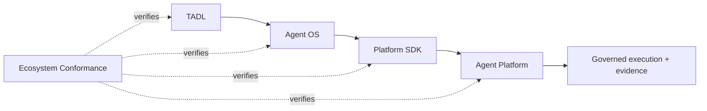

# Tinlance Agent Ecosystem Conformance

Agent OS participates in the ecosystem conformance gate maintained by TADL.

## Agent OS obligations

The conformance gate verifies that the OS:

- consumes the versioned Platform API 1.1 contract;
- uses the Platform adapter/transport rather than implementing authority;
- preserves authenticated tenant/subject identity;
- propagates idempotency and W3C trace context;
- interoperates with the same Platform reference boundary as the official SDK; and
- does not import Platform authority-kernel packages.

The suite is executed from the TADL repository against pinned commit SHAs in ecosystem.lock.json. A green repository-local CI run is necessary but not sufficient for ecosystem compatibility.

## Production boundary

Conformance proves contract and authority-boundary compatibility at the reference HTTP seam. It does not certify production PostgreSQL, enterprise identity, secret management, sandbox isolation, hosted telemetry, or operational recovery. Those remain production-runtime gates.

## Authority invariant

Agent OS composes intent and lifecycle. Agent Platform alone authorizes consequential actions. Developer artifacts, model output, memory, retrieved content, tool output, and remote-agent messages are untrusted data until independently validated by the authoritative Platform.