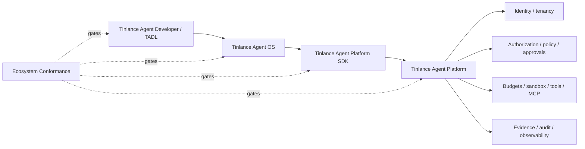

# Tinlance Agent Ecosystem Integration

Agent OS is the lifecycle/control-plane layer in the canonical four-repository stack:

TADL declares and validates developer artifacts. Agent OS owns workspace, session, task, workflow, memory, application, and lifecycle composition. The official Platform SDK owns the typed client contract and transport surface. Agent Platform alone owns consequential authority.

The consequential path is:

`developer artifact -> OS task/workflow -> SDK request -> Platform authorization/policy/approval -> governed execution -> Platform evidence/events -> OS lifecycle`

The shared wire contract is **Platform API 1.1**, using **POST /v1/agent-platform** and `governed-execution.v1`. Tenant and subject identity are bound to the authenticated Platform principal; idempotency and W3C trace context are preserved across the boundary.

Agent OS already contains a concrete `AgentPlatformAdapter` and `HttpPlatformTransport`. They are contract adapters, not a second authority engine. The cross-repository integration gate in TADL validates this adapter against the same Platform reference boundary consumed by the official SDK.

Production deployment seams—durable PostgreSQL, external secrets, sandbox supervision, enterprise identity, and telemetry—remain explicitly outside this repository.

## Conformance

The Agent Developer-hosted ecosystem conformance suite is the executable compatibility gate for the four repositories. It validates the shared API 1.1 contract, SDK/OS interoperability, identity binding, idempotency, trace propagation, transport security, and authority dependency direction against pinned revisions. Production infrastructure certification remains separate.

## Milestone vocabulary

M0–M14 remain the canonical Agent Platform roadmap. The supplemental M13.1–M13.3 production-runtime hardening labels are implementation traceability only; they do not redefine canonical milestone meaning. Post-M14 production maturity is governed by M15–M29.

## Budget governance boundary

Consequential execution budget is Platform authority. Requests may carry declared execution limits, but only the Platform execution boundary can reserve, consume or release budget. Reservations are bound to tenant, agent, run, action and resource; quota exhaustion and scope/replay conflicts fail closed. SDK/OS/TADL layers must not implement local budget authority or treat client-side estimates as authorization.

## M13.5 tool authority reconciliation

The OS may orchestrate tool lifecycle and sandbox configuration, but it never grants tool authority. Consequential execution must traverse the Platform policy boundary and consume a Platform-issued single-use permit; sandbox workspace roots are Platform-governed policy inputs.

## M13.6–M13.8 production-runtime reconciliation

M13.6–M13.8 reconciliation: OS orchestration may propagate execution-scoped secret references and correlation context, but cannot resolve provider secrets, sign evidence, or grant authority. Platform owns secret scope validation, evidence/audit integrity and security-event correlation contracts.
