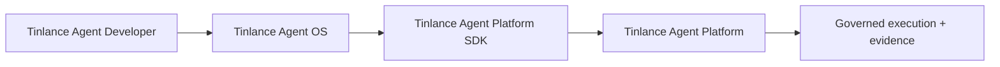

# Tinlance Agent Ecosystem Integration

Agent OS is the lifecycle/control-plane layer in the canonical four-repository stack:

TADL declares and validates developer artifacts. Agent OS owns workspace, session, task, workflow, memory, application, and lifecycle composition. The official Platform SDK owns the typed client contract and transport surface. Agent Platform alone owns consequential authority.

The consequential path is:

`developer artifact -> OS task/workflow -> SDK request -> Platform authorization/policy/approval -> governed execution -> Platform evidence/events -> OS lifecycle`

The shared wire contract is **Platform API 1.1**, using **POST /v1/agent-platform** and `governed-execution.v1`. Tenant and subject identity are bound to the authenticated Platform principal; idempotency and W3C trace context are preserved across the boundary.

Agent OS already contains a concrete `AgentPlatformAdapter` and `HttpPlatformTransport`. They are contract adapters, not a second authority engine. The cross-repository integration gate in TADL validates this adapter against the same Platform reference boundary consumed by the official SDK.

Production deployment seams—durable PostgreSQL, external secrets, sandbox supervision, enterprise identity, and telemetry—remain explicitly outside this repository.
